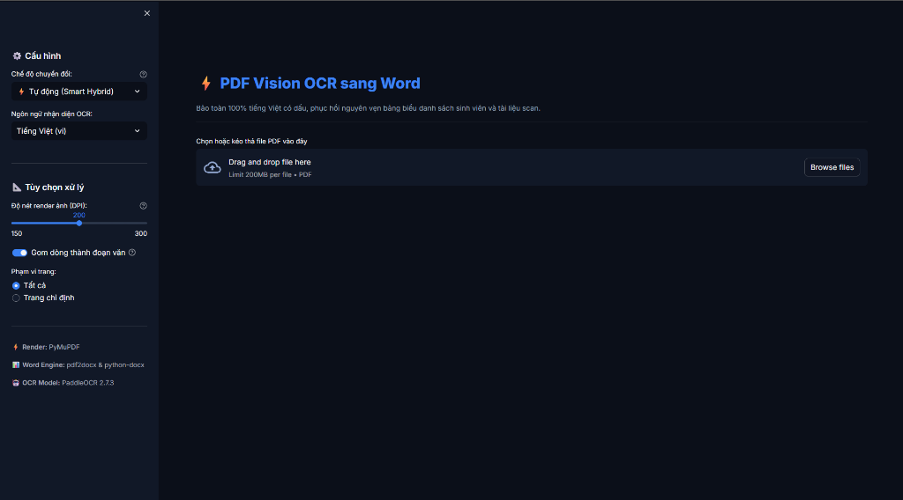

# ⚡ PDF Vision OCR - Chuyển đổi & Trích xuất PDF Đa Định Dạng



Ứng dụng nhận diện ký tự quang học (OCR) thông minh, chuyển đổi và trích xuất tài liệu PDF tiếng Việt (kể cả PDF scan & chụp ảnh) sang **Word (.docx)**, **Excel (.xlsx)**, **Searchable PDF (.pdf)** và **Markdown (.md)** với khả năng bảo toàn 100% tiếng Việt có dấu và cấu trúc bảng biểu.

---

## ✨ Tính năng nổi bật

- **Bảo toàn 100% tiếng Việt có dấu & Bảng biểu**: Tự động phát hiện Digital PDF và chuyển đổi giữ nguyên cấu trúc bảng và toàn bộ dấu tiếng Việt từ tài liệu gốc.
- **Tiền xử lý ảnh thông minh (OpenCV)**:
  - **Tự động xoay thẳng (Auto-Deskew)**: Tự phát hiện góc nghiêng và xoay thẳng văn bản về 0°.
  - **Khử bóng râm & Tẩy nền (Shadow Removal)**: Triệt tiêu bóng tay, bóng mờ khi chụp tài liệu bằng điện thoại.
  - **Tăng tương phản nét chữ (CLAHE)**: Tăng độ đậm nét cho chữ mờ hoặc mực nhạt.
- **Xuất đa định dạng (Multi-Format Export)**:
  - 📄 **Word (.docx)**: Văn bản chuẩn, đoạn văn nối liền, phân trang chính xác.
  - 📊 **Excel (.xlsx)**: Trích xuất bảng biểu, chia cột, định dạng lưới chuyên nghiệp (hỗ trợ sheet Tổng hợp).
  - 🔍 **Searchable PDF (.pdf)**: Giữ nguyên ảnh scan nhưng chèn lớp chữ vô hình, cho phép `Ctrl + F` tìm kiếm và copy chữ trực tiếp.
  - 📝 **Markdown (.md)**: Phục vụ lưu trữ nhẹ hoặc nạp dữ liệu vào các hệ thống AI/RAG.
  - 📦 **Gói ZIP (.zip)**: Tải toàn bộ các định dạng đã chọn chỉ với 1 click.
- **Không phụ thuộc Poppler ngoài**: Sử dụng **PyMuPDF** render trực tiếp trong RAM, tốc độ cao, không cần cấu hình PATH phức tạp.
- **Mô hình học sâu PaddleOCR 2.7.3**: Nhận diện quang học cho tài liệu scan thuần túy.
- **Giao diện Web Streamlit chuẩn Dark Mode**: Đồng nhất 100% font chữ công nghệ **Inter & Geist**, bố cục 2 cột trực quan.

---

## 🚀 Hướng dẫn cài đặt & Chạy cục bộ

### Yêu cầu hệ thống
- Python 3.10, 3.11 hoặc 3.12 (khuyên dùng 64-bit).

### 1. Khởi tạo môi trường ảo
Trên Windows (PowerShell):
```powershell
python -m venv .venv
.\.venv\Scripts\Activate.ps1
```

Trên Linux / macOS:
```bash
python3 -m venv .venv
source .venv/bin/activate
```

### 2. Cài đặt các thư viện cần thiết
```bash
pip install --upgrade pip
pip install -r requirements.txt
```

### 3. Khởi chạy ứng dụng Web
```bash
streamlit run src/app.py
```
Sau khi chạy, mở trình duyệt truy cập: `http://localhost:8501`.

---

## 🐳 Khởi chạy bằng Docker

Bạn có thể chạy ứng dụng mà không cần cài đặt môi trường Python cục bộ:

```bash
# Xây dựng Docker image
docker build -t pdf-vision-ocr .

# Chạy container
docker run -d -p 8501:8501 --name pdf-ocr-app pdf-vision-ocr
```
Truy cập giao diện tại: `http://localhost:8501`.

---

## 📂 Cấu trúc thư mục

```text
pdf-vision-ocr/
├── assets/
│   └── thumbnail.png          # Ảnh xem trước giao diện dự án
├── src/
│   ├── core/
│   │   ├── __init__.py
│   │   ├── image_preprocessor.py # Tiền xử lý ảnh: Deskew, khử bóng, tăng tương phản
│   │   ├── exporters.py          # Bộ xuất: Excel (.xlsx), Searchable PDF, Markdown, ZIP
│   │   └── ocr_engine.py         # Lõi điều phối: Smart Hybrid (Digital & OCR Vision)
│   ├── app.py                    # Ứng dụng giao diện web Streamlit
│   └── __init__.py
├── requirements.txt           # Danh sách thư viện phụ thuộc
├── Dockerfile                 # Đóng gói container
├── .gitignore
└── README.md                  # Hướng dẫn sử dụng dự án
```

---

## 💡 Mẹo tối ưu hóa kết quả OCR

1. **Đối với tài liệu mờ, chữ nhỏ**: Trong thanh bên (Sidebar), chọn chất lượng **300 DPI** để tăng cường độ nét của ảnh trước khi đưa vào mô hình OCR.
2. **Đối với tài liệu nhiều trang**: Bạn có thể xử lý thử một vài trang đầu (ví dụ nhập `1-2` vào ô "Trang tùy chọn") để kiểm tra độ chính xác trước khi chuyển đổi toàn bộ tài liệu.
